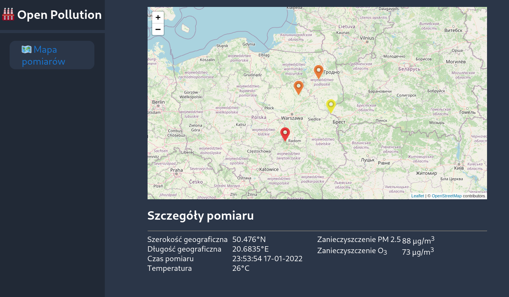

# Open Pollution

Open Pollution is an app demonstrating usage of [PDCL library](https://github.com/areknoster/public-distributed-commit-log).

Think of PDCL producers as air pollution sensors and consumers like users who
want to see pollution level in their area. Open Pollution enables you to see
messages (pollution measurements) on a world map. Also it gives you tools to
mock real sensors.

## Installation

Install Open Pollution in Docker Compose.

```bash
  make build-docker
```

## Run Locally

Run the app by typing

```bash
  make run-docker
```

This sets up a local IPFS node, backend server for  and UI. Now go to
`http://localhost:3000` and enjoy!

## Screenshots



## Tech Stack

**UI:** React, Jest, Leaflet

**Backend:** Go, PDCL

## Authors

- [@jmichalak9](https://www.github.com/jmichalak9)
- [@areknoster](https://github.com/areknoster)
